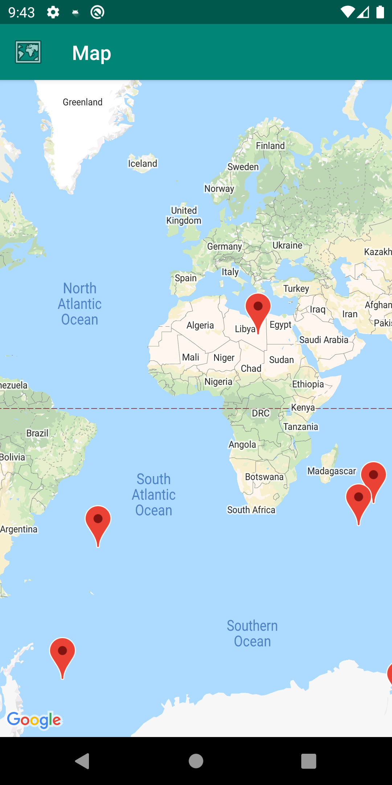
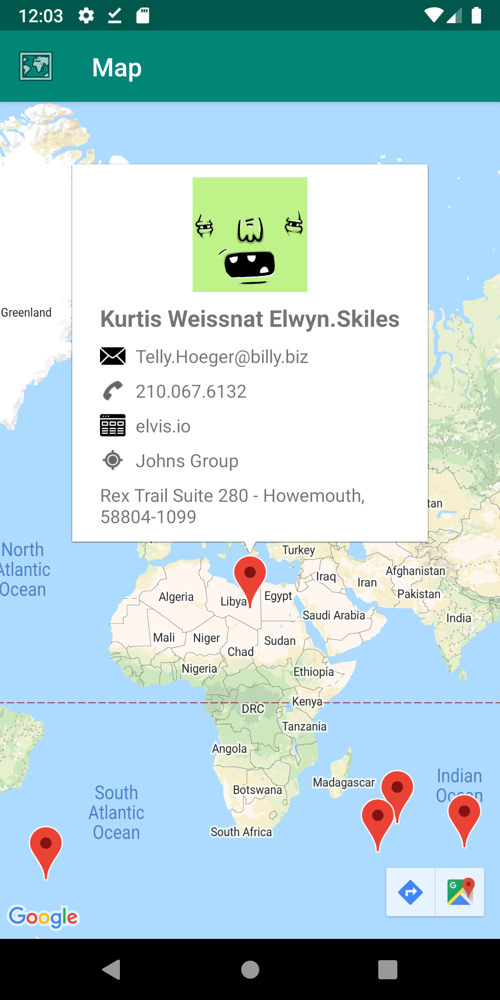
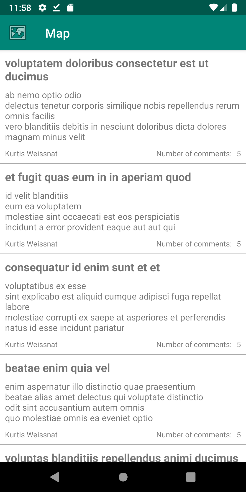
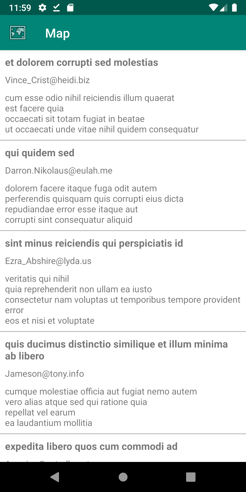

# Kotlin Playbook Android
Developed as a challenge project: https://github.com/Babylonpartners/android-playbook/blob/master/recruitment/code_challenge.md

The app should have two screens, as follows:

- A screen with a list of clickable posts with at least the post title
- A detail screen for the selected post with at least the follow:
  - Post title
  - Post body
  - Author name
  - Number of comments
  
You can fetch all the required data from the following API endpoints:
- GET http://jsonplaceholder.typicode.com/posts
- GET http://jsonplaceholder.typicode.com/users 
- GET http://jsonplaceholder.typicode.com/comments 

Feel free to add more things to the app using the other available APIs or https://api.adorable.io/avatars to generate a random avatar for the posts authors.


### Screenshots
Map | Map Info | Last Comments | Open comments
--- | --- | --- | ---
 |  |  | 


## Licence
Copyright 2019 Daniel Freitas Vilha
```
Permission is hereby granted, free of charge, to any person obtaining a copy
of this software and associated documentation files (the "Software"), to deal
in the Software without restriction, including without limitation the rights
to use, copy, modify, merge, publish, distribute, sublicense, and/or sell copies
of the Software, and to permit persons to whom the Software is furnished to do so,
subject to the following conditions:

The above copyright notice and this permission notice shall be included in all
copies or substantial portions of the Software.

THE SOFTWARE IS PROVIDED "AS IS", WITHOUT WARRANTY OF ANY KIND, EXPRESS OR
IMPLIED, INCLUDING BUT NOT LIMITED TO THE WARRANTIES OF MERCHANTABILITY,
FITNESS FOR A PARTICULAR PURPOSE AND NONINFRINGEMENT. IN NO EVENT SHALL
THE AUTHORS OR COPYRIGHT HOLDERS BE LIABLE FOR ANY CLAIM, DAMAGES OR OTHER
LIABILITY, WHETHER IN AN ACTION OF CONTRACT, TORT OR OTHERWISE, ARISING FROM,
OUT OF OR IN CONNECTION WITH THE SOFTWARE OR THE USE OR OTHER DEALINGS IN THE
SOFTWARE.
```